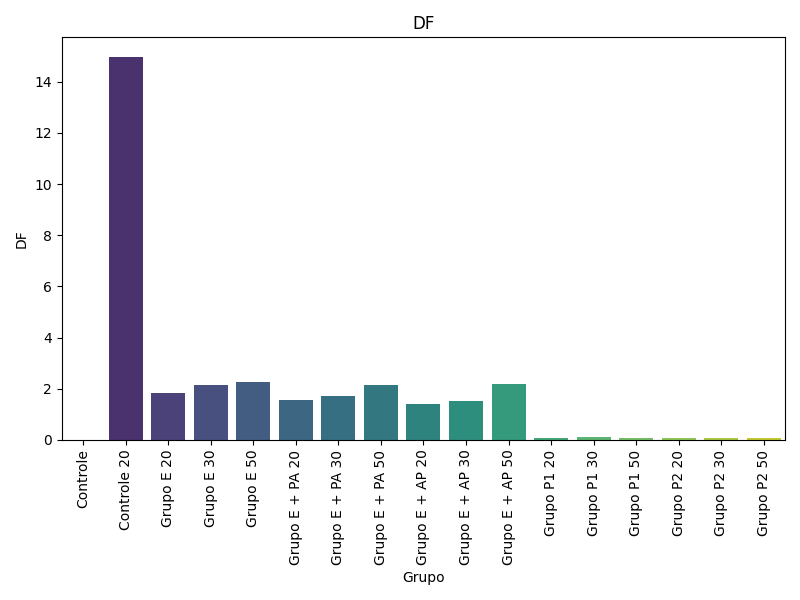
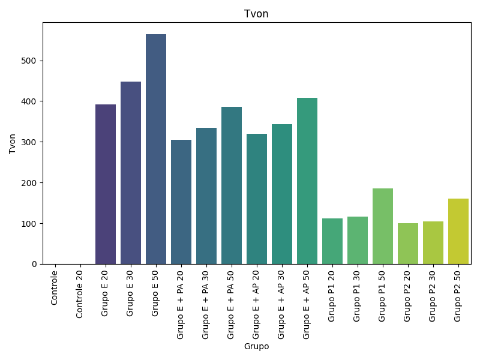
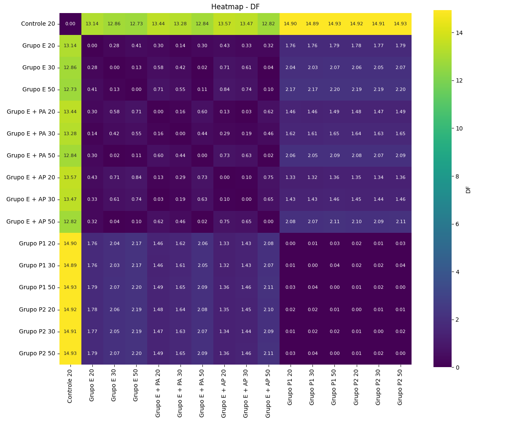
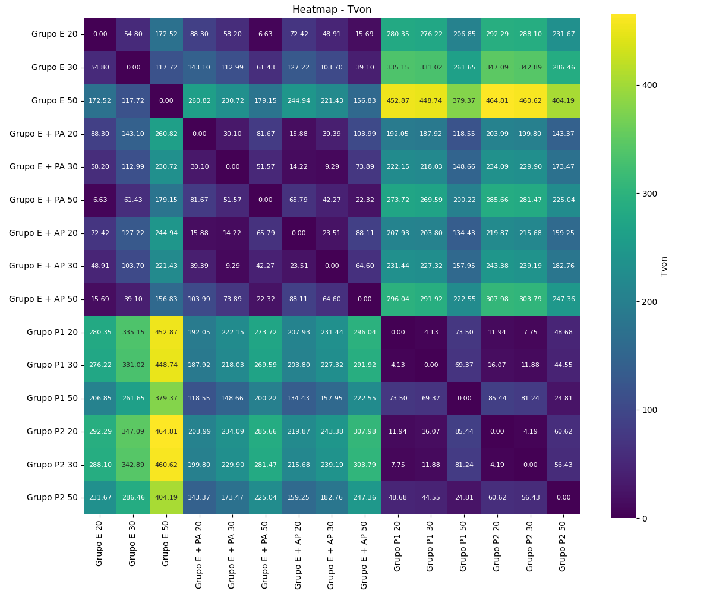

# Análise Biomecânica de Fratura do Maléolo Posterior com MEF 

## 📌 Objetivo
Analisar o comportamento biomecânico de uma fratura do maléolo posterior utilizando simulação por MEF, comparando 6 técnicas de fixação.

---

## 📊 Resultados

### Deslocamento (DF)

### Tensão de Von Mises (Tvon)

### Heatmap de Deslocamento

### Heatmap de Tensões

---

## 🔍 Insight

Os resultados mostram diferenças entre as técnicas de fixação, com variações nos níveis de tensão e deslocamento, permitindo identificar abordagens com maior estabilidade biomecânica.

---

## 🛠️ Tecnologias

- Python  
- Pandas  
- Matplotlib  
- Seaborn  

---

## ▶️ Como executar

pip install -r requirements.txt  
python src/main.py

## 🔍 Conclusão

A análise permitiu identificar diferenças relevantes entre as técnicas de fixação, demonstrando como a combinação de simulação computacional (MEF) e análise de dados pode gerar insights úteis para tomada de decisão.